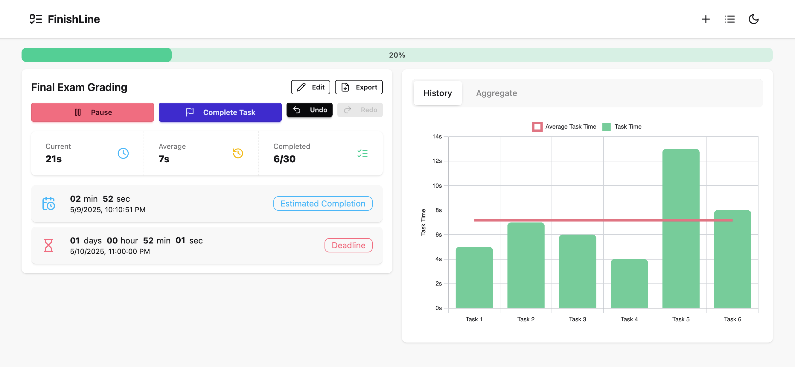

# FinishLine

**FinishLine** is a web application for tracking and analyzing your progress on multi-step or repetitive tasks. It helps you record the time taken for each step, visualize your performance, estimate completion, and manage multiple sessions—all in your browser, with fast, responsive UI and persistent local storage.



## Features

**Session Management**
- Create, edit, delete, and switch between named sessions.
- Specify the number of tasks and (optionally) a deadline for each session.
- Resume or pre-fill progress with average time for previous tasks.

**Task Recording**
- Start/pause timing for each task step.
- One-click or spacebar to mark task completion.
- Undo/redo actions with keyboard shortcuts.

**Statistics & Visualization**
- See real-time stats: current task time, average, completed/total.
- Live ETA (Estimated Time of Arrival) for session completion.
- Countdown for session deadline.
- Interactive charts: per-task history, hourly/daily/weekly aggregate stats (count, total, or average duration).

**Data Export**
- Export session data as CSV.

**User Interface**
- Responsive, mobile-friendly design.
- Light/dark theme toggle.
- Clean, modern look.

**Privacy**
- All data is stored locally in your browser's `localStorage`. No account or cloud required.
## Keyboard Shortcuts

| Shortcut         | Action              |
|------------------|--------------------|
| Space            | Complete task      |
| Ctrl/Cmd + Z     | Undo               |
| Ctrl/Cmd + Y     | Redo               |
| Ctrl/Cmd + N     | New session       |
| Ctrl/Cmd + S     | Edit session       |
| Ctrl/Cmd + P     | Start/Pause        |

## Project Structure

```
src/
├── App.tsx                # Main application container
├── components/            # Reusable UI components (Navbar, Modals, Stats, etc.)
├── hooks/                 # Custom React/Preact hooks
├── utils/                 # Utility functions (formatting, storage, etc.)
├── context/               # App-wide state (such as theme).
├── types.ts               # TypeScript type definitions
├── constants.ts           # App constants (keys, etc.)
└── index.css              # Tailwind/DaisyUI styles
```
## Getting Started

### Prerequisites

- **Node.js** (v16 or newer recommended)
- **npm** (v9 or newer)

### Installation

```
npm install
```

### Development

```
npm run dev
```

Then open [http://localhost:5173](http://localhost:5173) in your browser.

### Production Build

```
npm run build
npm run preview
```

This will build and preview your production-ready app.
## Tech Stack

- **UI:** [DaisyUI](https://daisyui.com/) + [Tailwind CSS](https://tailwindcss.com/)
- **Icons:** [Lucide](https://lucide.dev/)
- **Charts:** [Chart.js](https://www.chartjs.org/)
- **Framework:** [Preact](https://preactjs.com/)
- **Build Tool:** [Vite](https://vite.dev)
## Contributing

Bug reports, feature requests, and pull requests are welcome!
Please open an issue or PR if you have suggestions or find a bug.
## License

[MIT](LICENSE.md)
